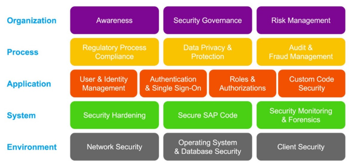

# CONTROL CATALOG

This catalog operationalizes SAP's Secure Operations Map V2.6 (07/2025 - [Note 2253549]("https://me.sap.com/notes/0002253549")) into 96 auditable controls. 
The Map organizes SAP security into five layers, from foundational infrastructure up to organizational governance, each built on the one below it -- like courses of bricks in a defensive wall. 

Each layer breaks down into building blocks; each building block below carries controls in the 'Control Catalog' tab at this [ TEMPLATE](SAP_Security_Control_Catalog--TEMPLATE.xlsx 'SAP Security Control Catalog Template'), referenced by Control ID.		




|Layer| Buiding Blocks| Control ID Template| Control ID Description|
| -------- | ------- | ------- | ------- |
|Organization| Awareness| ORG-AWA-xxx| ------- |
|Organization| Security Governance| ORG-GOV-xxx| ------- |
|Organization| Risk Management| ORG-RSK-xxx| ------- |
|Process| Regulation Process Compliance| PRC-REG-xxx| ------- |
|Process| Data Privacy & Protection| PRC-DPP-xxx| ------- |
|Process| Audit & Fraud Management| PRC-AFM-xxx| ------- |
|Application| User & Identity Management| APP-UIM-xxx| ------- |
|Application| Authentication & Single Sign-On| APP-AUT-xxx| ------- |
|Application| Roles & Authorization| APP-ROL-xxx| ------- |
|Application| Custom Code Security| APP-CCS-xxx| ------- |
|System| Security Hardening| SYS-HRD-xxx | ------- |
|System| Secure SAP Code| SYS-COD-xxx | ------- |
|System| Security Monitoring & Forensics| SYS-MON-xxx | ------- |
|Environment| Network Security| ENV-NET-xxx | ------- |
|Environment| Operation System & Database Security| ENV-OSD-xxx | ------- |
|Environment| Client Security| ENV-CLI-xxx | ------- |

> _xxx_ is running number: 001 - 999

## § SAMPLE: APP-ROL-004 
**§ CONTROL OBJECTIVE**<BR>
Restrict and monitor high-risk authorizations

**§ CONTROL DESCRIPTION**<BR>
Identify, restrict, and continuously monitor assignment/use of critical authorizations (SAP_ALL, SAP_NEW, debug-and-change S_DEVELOP, direct table maintenance S_TABU_DIS/S_TABU_NAM).

**§ SECURITY ADVISORY**<BR>
The assignment of critical basis authorization should be tightly controlled. 
Especially the assignment of the following critical basis authorizations should be avoided or limited as far as possible

**§ FRAMEWORK CONTROL**<BR>
|Franework| ID| Description| Detail |
| -------- | ------- | ------- | ------- |
|ISO 27001 | A.8.2| Privileged Access Rights|Since S_DEVELOP allows modification of business logic and security-relevant programs, it qualifies as a privileged authorization and should not be broadly assigned. |
|ISO 27001 | A.8.32| Change Management| Any change to applications or systems should follow formal change management procedures rather than ad hoc modification by users. Direct production S_DEVELOP access often violates the spirit of controlled change management |
| NIST 800-53| AC-6 | Least Privilege | Granting only the minimum permissions needed for a role.|
| NIST 800-53| CM-5(5) | Privilege Limitation for Production | Privileges to change production systems should be limited and periodically reviewed.|
| NIST 800-53| CM-5 | Access Restrictions for Change | Restrict change privileges in production environments |
| SOX | ITGC | Program Change Management | Although SOX does not mention SAP authorizations directly, auditors commonly assess |
| COBIT | BAI06 | Managed Changes | Controlled changes + Least privilege + Monitoring privileged users |


> **REFERENCE:** 
>
> 1. SAP Security Baseline Template [SBL2.6_2.3.3_CRITAU-A](Security_Baseline_Template_V2.6.pdf 'Page 30')<BR>
> 2. SecurityBridge [U5000_0007 Developer account](https://abap-experts.atlassian.net/wiki/spaces/SB/pages/1057816595/0007+-+Developer+account)<BR>
><BR>


### § SAMPLE: APP-ROL-004-001
```text
S_DEVELOP with ACTVT: 01/02
S_DBG with ACTVT: 02
```
**§ SECURITY ADVISORY**<BR>
In SAP, granting S_DEVELOP with ACTVT = 01 (Create) and 02 (Change) is often considered one of the highest-risk authorizations outside of SAP_ALL because it potentially allows a user to modify executable logic within the SAP system.

Ensure that nobody has this permission in Production system.
When necessary, assign to PAM/FF only that enables action reviews from PAM/FF controller.

### § SAMPLE: APP-ROL-004-002
```text
S_DEVELOP with ACTVT: 90
```


**§ SECURITY ADVISORY**<BR>
It is generally not considered secure or a least-privilege approach to grant S_DEVELOP with ACTVT=90 broadly to anyone
including ABAP experts for debugging other users' sessions.

Granting this authorization can introduce several risks:

--------------------------------------------------------
1. Access to Sensitive Business Data
--------------------------------------------------------
When debugging another user's session, the debugger can inspect:
- Variables in memory
- Internal tables
- User input
- Business documents being processed
- Potentially sensitive information such as:
- Employee data
- Customer data
- Financial data
- Credentials or tokens temporarily held in memory

This may bypass normal business role segregation.

--------------------------------------------------------
2. Privilege Escalation Risks
--------------------------------------------------------
A skilled ABAP developer may:
- Manipulate variable values during debugging
- Bypass application checks
- Execute code paths not normally available
- Potentially perform transactions or updates beyond their business authorizations

The risk varies by SAP version and debugger restrictions.

--------------------------------------------------------
3. Segregation of Duties (SoD) Violations
--------------------------------------------------------
From an audit perspective (SOX, ISO 27001, NIS2, DORA, etc.):
- Developers should not have unrestricted access to production business data.
- Debugging production user sessions is often classified as a privileged activity.
- Auditors frequently challenge broad assignment of debugging permissions in Production.

--------------------------------------------------------
4. Data Privacy Concerns
--------------------------------------------------------
Debugging another user's session may expose:
- Personal data (GDPR)
- HR information
- Payroll data
- Customer confidential information

This creates privacy and compliance concerns.


```
[SECURE ALTERNATIVES]

Option 1: PAM ID or Firefighter ID (Recommended)
Option 2: Temporary Role Assignment
Option 3: Controlled Support Procedures such as Proactively monitor given user's activity 
```
```
[What does ACTVT=90 mean ?]

 In authorization object S_DEVELOP, activity 90 is commonly used for debugging.
Combined with appropriate development object values,
it can allow a user to debug programs and,
depending on the SAP release and configuration, attach to other users' sessions.

```

